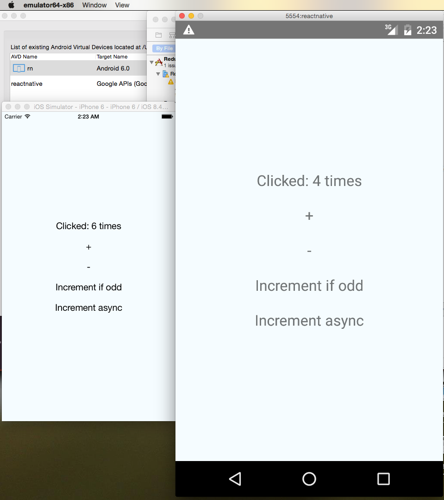

# react-native-counter-ios-android

> Minimal implement of redux counter example on ReactNative iOS and Android

I don't use any syntax out of React Native's enabled transformations, so no any patch on ReactNative is needed.

- react-native 0.11
- redux 3
- react-redux 
- redux-thunk



## How to run this Porject

#### Setup iOS and Android env

see

- [iOS setup](https://facebook.github.io/react-native/docs/getting-started.html#ios-setup) 
- [Android setup](https://facebook.github.io/react-native/docs/android-setup.html#content)

#### Install npm dependecies

```sh
npm i
```

#### run iOS

Open `ios/ReduxCounterUniversal.xcodeproj` and hit run in Xcode.

#### run Android

```sh
emulator -avd [your_emulator_name] -gpu on &
react-native run-android
```
